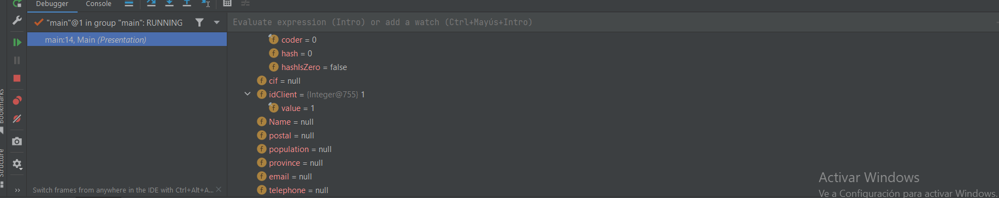
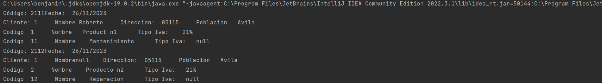

## Description de la tarea

Digitalizar una empresa  de productos y servicios y hacer mas accesible sus ventas,
cuenta con datos de impresion y medelado 

## ¿Cómo se ha implementado?

Se a modelado cada una de las entidades, que se muestran en el negocio 

## Keywords

Diagrama de clases, atributos, metodos, main, arrayList, etc

## Screenshots or Video

